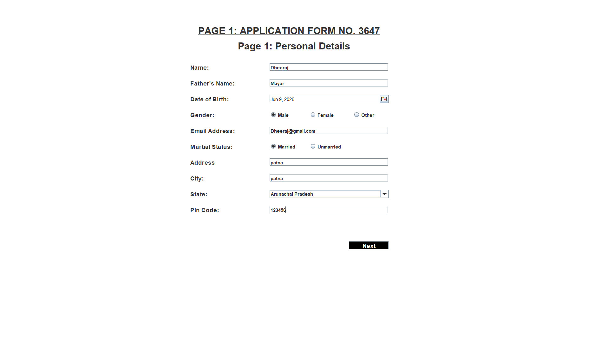
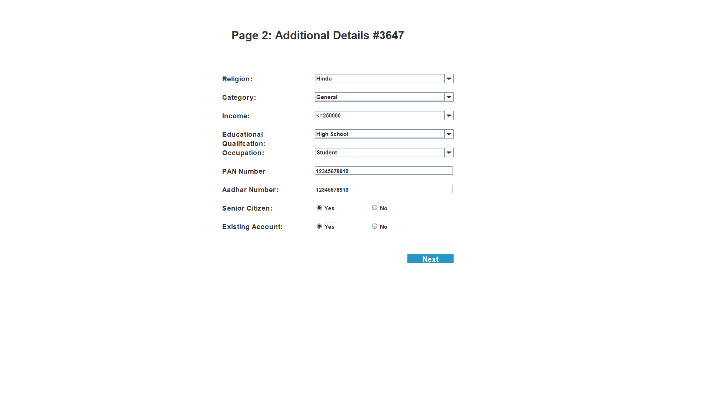
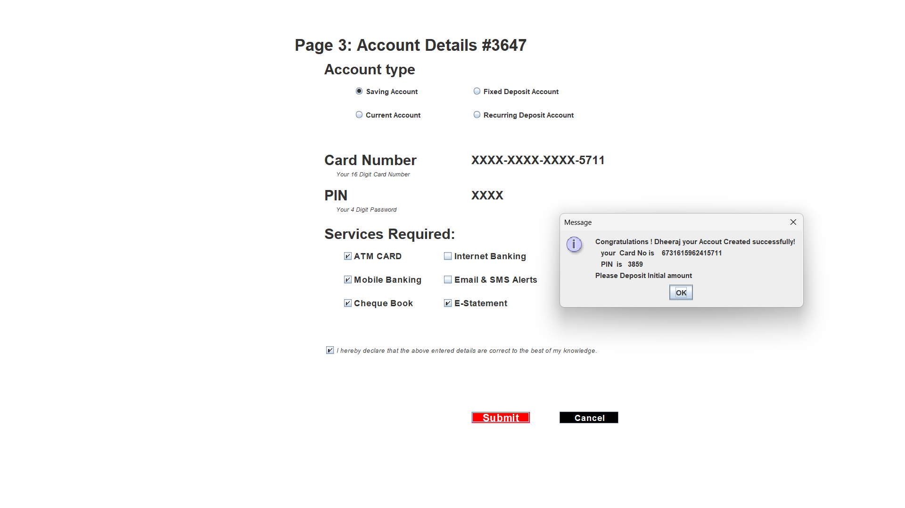
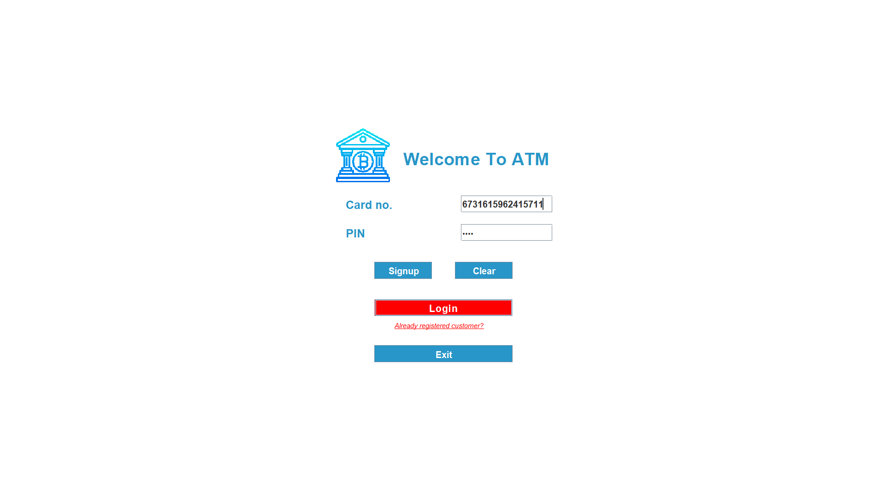
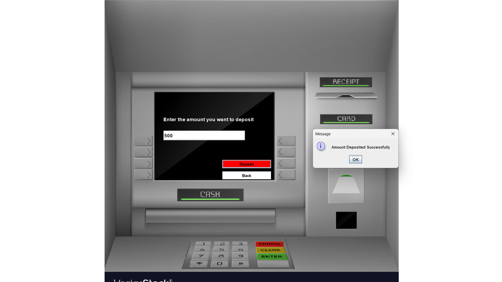
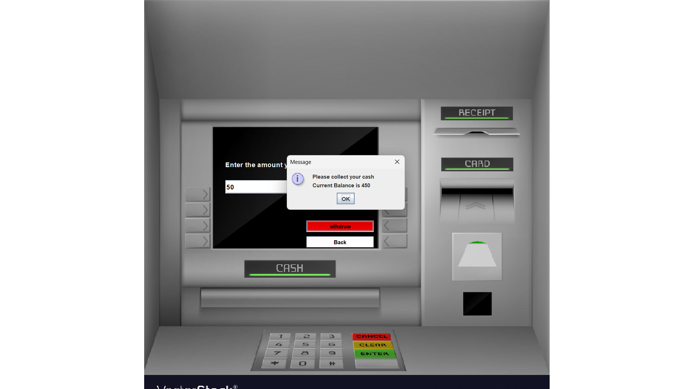
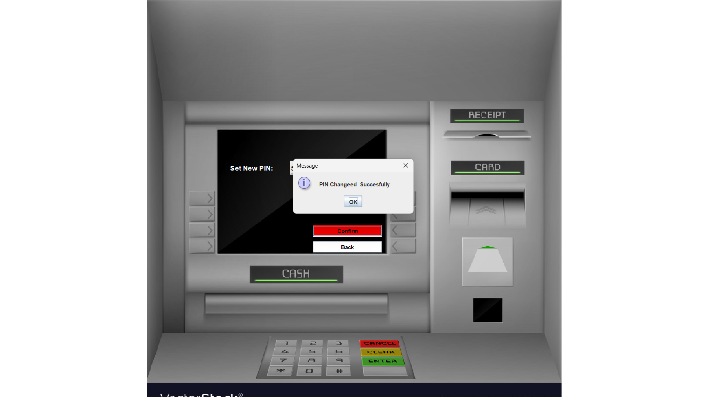
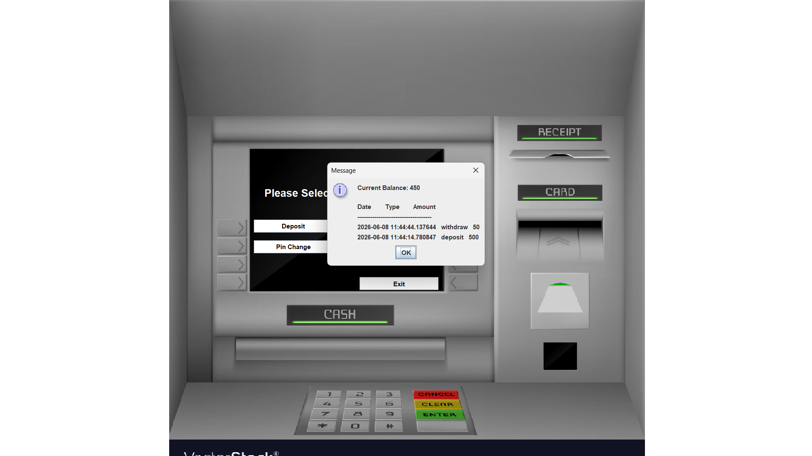

# 🏦 Bank Management System (ATM Simulator)

A fully operational Desktop Application designed to simulate core banking services and automated teller machine (ATM) functionalities. This project features a full graphical user interface (GUI) built using **Java Swing and AWT**, fully integrated with a secure **PostgreSQL** database backend inside the **Eclipse IDE**.

## 🌟 Key Features
* **Multi-Stage User Authentication**: Secure account signup process spanning multiple verification forms (`Signup1`, `Signup2`, `Signup3`) alongside standard credential login.
* **ATM Simulator Dashboard**: Interactive grid mapping complex real-time operations like Cash Withdrawal, Instant Cash Deposit, and Balance Inquiries.
* **PIN Customization**: Built-in security module executing dynamic validation parameters for seamless PinChange routines.
* **Ledger Registry**: Robust database architecture rendering quick auditing via dedicated real-time Transactions tracking logs (Mini Statement).

## 🛠️ Tech Stack & Tooling
* **Core Engine**: Java Standard Edition (Java SE)
* **GUI Framework**: Java Swing Framework, Abstract Window Toolkit (AWT API)
* **Database Layer**: JDBC Driver Architecture, **PostgreSQL 16**
* **IDE**: Eclipse IDE

---

## 📷 Project Screenshots

### 1. User Registration Flow

| Signup Page 1 | Signup Page 2 | Signup Page 3 |
|---|---|---|
|  |  |  |

### 2. Authentication & Main Dashboard

| Login via Credentials | Main Homepage / Dashboard |
|---|---|
|  | .png) |

### 3. ATM Transaction Operations

| Initial Deposit Frame | Cash Withdrawal Grid |
|---|---|
|  |  |

### 4. Account Security & Live Audit

| PIN Change Module | Real-time Mini Statement |
|---|---|
|  |  |
